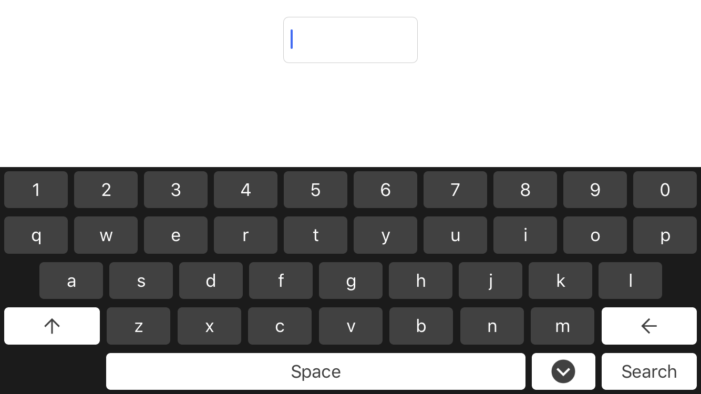
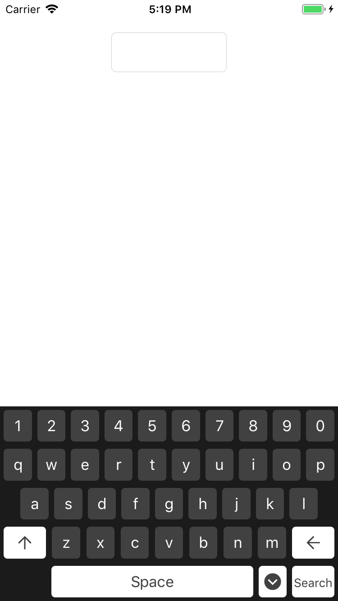

# DKExternalKeyboard

[](https://travis-ci.org/deniskakacka/DKExternalKeyboard)
[](https://cocoapods.org/pods/DKExternalKeyboard)
[](https://cocoapods.org/pods/DKExternalKeyboard)
[](https://cocoapods.org/pods/DKExternalKeyboard)

## Example

To run the example project, clone the repo, and run `pod install` from the Example directory first.

 

## Installation

DKExternalKeyboard is available through [CocoaPods](https://cocoapods.org). To install
it, simply add the following line to your Podfile:

```ruby
pod 'DKExternalKeyboard'
```

## Usage

```swift
import DKExternalKeyboard
```

```swift
private lazy var keyboardContainer: DKExternalKeyboardView = {
    let keyboardContainer = DKExternalKeyboardView()
    keyboardContainer.keyboard.setDelegate(self)

    return keyboardContainer
}()
```

```swift
extension ViewController: DKExternalKeyboardDelegate {
    func didTapSearch(query: String?) {
        keyboardContainer.keyboard.hide()
    }
}
```

```swift
extension ViewController: UITextFieldDelegate {
    func textFieldDidBeginEditing(_ textField: UITextField) {
        keyboardContainer.keyboard.show(for: textField, on: view)
    }

    func textFieldShouldBeginEditing(_ textField: UITextField) -> Bool {
        let emptyViewForSystemKeyboard = UIView(frame: .zero)
        textField.inputView = emptyViewForSystemKeyboard

        return true
    }
}
```


## Author

deniskakacka, deniskakacka@gmail.com

## License

DKExternalKeyboard is available under the MIT license. See the LICENSE file for more info.
